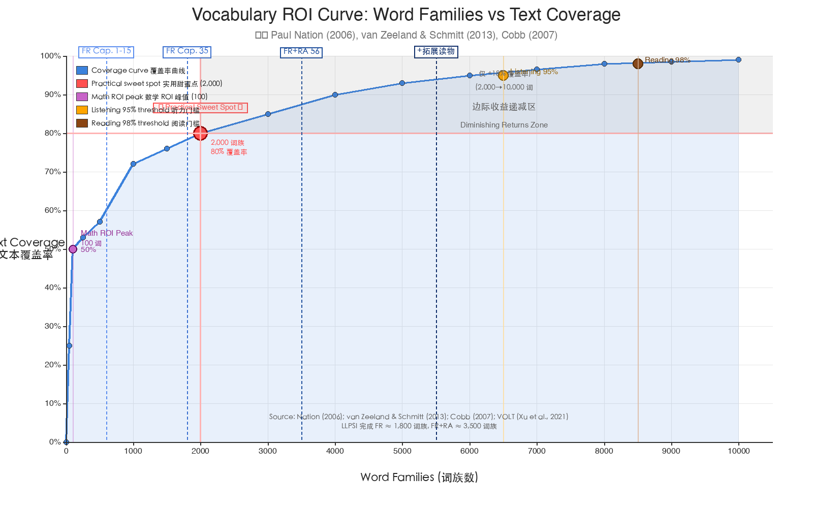

# LLPSI 学习目标与词汇量阈值研究 (按投产比分层版)

> **版本**: v2.0.0 | **更新时间**: 2026-06-06
> **核心结论**: **投产比最优的"实用甜蜜点"是 2,000 词族** (~80% 古典文本覆盖率)
> **LLPSI 的设计哲学与此一致**: FR 完成 = 1,800 词族 ≈ 甜蜜点,FR+RA = 3,500 词族 = 已进入边际收益递减区

---

## 〇、ROI 总览 (本文档核心新内容)

### 0.1 一句话结论

> **投产比最优 ≈ 2,000 词**。这不是数学上的 ROI 峰值(那个在 100 词),而是"实用性"与"投入成本"的纳什均衡点——再少不够用,再多不划算。



### 0.2 数学最优 vs 实用最优

| 目标 | 词汇量 | 覆盖率 | 每千词边际收益 | 评价 |
|:-----|------:|-------:|---------------:|:-----|
| **数学 ROI 峰值** | ~100 词 | 50% | 5.0% | 极高 ROI,但覆盖率太低,不实用 |
| **实用最优甜蜜点** ★ | **~2,000 词** | **80%** | **~2-4%** | **✅ 投产比与实用性的最佳平衡** |
| 独立阅读门槛 | ~6,000-8,000 词 | 95-98% | <0.5% | 学术标准,但 ROI 极低 |

### 0.3 边际收益递减表 (每千词的覆盖率提升)

| 词汇区间 | 每千词带来的覆盖率提升 | 倍数关系 |
|:---------|----------------------:|--------:|
| 0→100 词 | **5.0%** | **50× 基准** |
| 100→250 词 | 0.3% | 3× |
| 250→500 词 | 0.4% | 4× |
| 500→1000 词 | 0.1% | 1× (基准) |
| 1000→2000 词 | 0.1% | 1× |
| 2000→4000 词 | 0.1% | 1× |
| 4000→8000 词 | ~0.05% | 0.5× |

> **关键洞察**: 前 100 个词 (the, be, to, of…) 的 ROI 是后续区间的 50 倍。但只学 100 词,你认识一半句子却看不懂任何内容——这就是"数学最优"与"实用最优"的分歧点。

### 0.4 经典研究的覆盖率-词汇量对照

| 词汇量 (词族) | 文本覆盖率 | 用途 |
|--------------:|----------:|:-----|
| 1,000 词族 | ~72% | 基础生存,但每页仍有大量生词 |
| **2,000 词族** | **~80%** | **日常交流、新闻、简单小说** |
| 3,000 词族 | ~85% | 一般对话可应对,阅读仍需猜词 |
| 4,000 词族 | ~90% | 加上学术词汇表可覆盖学术文本 90% |
| 6,000-7,000 词族 | ~95% | 独立听懂的门槛 |
| 8,000-9,000 词族 | ~98% | 独立阅读的学术标准 |

> **数据来源**: Paul Nation 基于 BNC/COCA 大型语料库的研究 (Schmitt, Cobb, Horst & Schmitt, 2017 复制研究, [Cambridge Language Teaching](https://www.cambridge.org/core/journals/language-teaching/article/how-much-vocabulary-is-needed-to-use-english-replication-of-van-zeeland-schmitt-2012-nation-2006-and-cobb-2007/1D217A56A2E0056E67802A6A8360FDDE))
>
> **听力 vs 阅读**: van Zeeland & Schmitt (2013) 指出 95% 覆盖率对听力理解已足够,98% 才是独立阅读的理想标准。

---

## 一、按投产比分层的新学习路径 (★★★ 本文核心)

### 1.1 六层金字塔 (从底到顶)

```
        ▲ Tier 5: 学术独立阅读 (8,000+ 词族, 98% 覆盖率)
       ╱ ╲
      ╱   ╲  边际收益递减陷阱
     ╱ T4  ╲  Tier 4: 听力+拓展阅读 (5,000-6,000 词族, 93-95%)
    ╱───────╲
   ╱         ╲
  ╱  T3 已知   ╲  Tier 3: LLPSI RA 末段 (3,500 词族, 85%)
 ╱─────────────╲
╱   ★ 甜蜜点    ╲  Tier 2: LLPSI FR 完成 (1,800 词族, 80%) ★
╱─────────────────╲
▔▔▔▔▔▔▔▔▔▔▔▔▔▔▔▔▔▔
    Tier 1: 入门 (1,000 词族, 72%)
    Tier 0: 数学 ROI 峰值 (100 词, 50%) — 不可达
```

### 1.2 各层详述

#### Tier 0 (0-100 词): 数学 ROI 峰值 — 不可达
- **覆盖率**: 50%
- **问题**: 认识一半句子却看不懂任何内容
- **评价**: 数学最优但实际无意义,作为对照基准存在
- **LLPSI 对应**: 不可达(LLPSI 不区分生词密度,第 1 章就 25% 新词率)

#### Tier 1 (100-1,000 词): 入门门槛 — FR Cap. 1-15
- **LLPSI 章节**: FR Cap. 1-15 (累计 ~3,400 词形 ≈ **600-1,000 词族**)
- **覆盖率**: 50% → 72%
- **学习时长**: 每天 30-45 分钟,约 1.5-2 个月
- **阅读能力**: 可读 70% 大意,但每页仍大量生词
- **配套读物**: Colloquia Personarum Cap. 1-10, Fabellae Latinae 前 10 篇
- **本项目可生成的辅助**: 优先章节 (Cap. 8-13 语法墙、Cap. 25 密度墙) 的微阅读

#### Tier 2 ★ (1,000-2,000 词): ★★★ 实用最优甜蜜点 — FR Cap. 15-35
- **LLPSI 章节**: FR Cap. 15-35 (完成 FR,累计 ~11,000 词形 ≈ **1,800 词族**)
- **覆盖率**: 72% → 80%
- **学习时长**: 每天 30-45 分钟,约 2-3 个月(累计 4-5 个月)
- **阅读能力**: 可读 Fabulae Syrae 全部、Fabellae 全部、Fabulae 改写本
- **配套读物**: Colloquia Personarum 全部、Fabellae Latinae 全部、Fabulae Syrae 全部
- **本项目定位**: **⭐ 大多数学习者的合理终点**
- **为什么是甜蜜点**:
  - 覆盖率 80% = 每 5 个词只遇到 1 个生词,可猜词,流畅度可接受
  - 时间成本可控 (4-5 个月)
  - 边际收益仍合理 (再往后每千词收益不足 2%)
  - 可扩展性强 (80% 后通过阅读自然习得效率大幅提升)

#### Tier 3 (2,000-3,500 词): 边际收益递减区 — RA 主体
- **LLPSI 章节**: FR + RA Cap. 36-56 (累计 ~24,000 词形 ≈ **3,500 词族**)
- **覆盖率**: 80% → 85%
- **学习时长**: 每天 30-45 分钟,约 3-4 个月(累计 7-9 个月)
- **阅读能力**: 可读 Ovid/Plautus 改写本、Aeneid 节选
- **配套读物**: Sermones Romani、Aeneis (Ørberg 版)、Ars Amatoria、Amphitryo
- **本项目定位**: ⚠️ 进入"投资过剩"风险区——多数爱好者应在此停步
- **陷阱**: 每多花 1 个月,覆盖率仅 +1.6%,投入产出比急剧下滑

#### Tier 4 (3,500-6,000 词): 听力门槛 + 拓展阅读
- **LLPSI 章节**: FR + RA + 3-5 个拓展读物
- **覆盖率**: 85% → 93-95%
- **学习时长**: 1-2 年(主要是泛读量积累)
- **阅读能力**: 较舒适读 Ovid 原文、Plautus 原文
- **配套读物**: Bello Gallico (Caesar)、Cena Trimalchionis (Petronius)、Catilina
- **本项目定位**: 学术爱好者门槛

#### Tier 5 (6,000-8,000+ 词): 学术独立阅读
- **来源**: 完成上述 + 大量原文阅读 (Tacitus, Livy, Quintilian, Pliny)
- **覆盖率**: 95% → 98%+
- **学习时长**: 持续 3+ 年
- **阅读能力**: 可读几乎所有古典散文
- **说明**: LLPSI 不是终点,而是基础;之后需大量原文阅读持续扩词
- **数学现实**: Cobb (2007) 研究指出,靠自然阅读来积累 3,000 词以后的词汇,年阅读量需达 30 万字以上

### 1.3 投产比视角下的 LLPSI 设计再评估

**关键发现**: LLPSI 自身的设计哲学,实际上**已经瞄准了 2,000 词甜蜜点**:

| LLPSI 完成度 | 累计词族 | 相对甜蜜点(2,000) | 评价 |
|:-------------|--------:|------------------:|:-----|
| FR Cap. 15 | ~600-1,000 | 50% | 远未达甜蜜点 |
| **FR Cap. 35** | **~1,800** | **90%** | **★ Ørberg 的设计终点 = 甜蜜点的 90%** |
| FR + RA Cap. 56 | ~3,500 | 175% | 已超过甜蜜点 75%,进入边际递减区 |

**这意味着什么?**
1. **大多数学习者的合理终点是 FR Cap. 35 (1,800 词族)**,接近 2,000 甜蜜点
2. **RA 是为"研究级"用户设计的延伸**——对爱好者来说可能"投资过剩"
3. 本项目的"分级读物匹配"功能应**重点支持 Tier 1-2 用户**,而非追求完整 RA 链

---

## 二、权威研究框架 (Nation, Hu & Nation, Laufer 等)

### 2.1 英语词汇量与覆盖率经典对照 (修正版,基于 Schmitt 2017 复制研究)

| 词汇量 (词族) | 覆盖率 | 学习阶段 | 阅读能力 |
|--------------:|-------:|:---------|:---------|
| 100 | ~50% | 起步 | 几乎不可读 |
| 1,000 | **~72%** | A1-A2 | 日常对话、分级读物 |
| **2,000** | **~80%** | **A2** | **简单小说、新闻** ★甜蜜点 |
| 3,000 | ~85% | A2-B1 | 流畅日常阅读 |
| 4,000 | ~90% | B1 | 普通新闻/非学术 |
| 5,000 | ~93% | B1-B2 | 普通文本 |
| **6,000-7,000** | **~95%** | B2 | **听力舒适门槛** |
| **8,000-9,000** | **~98%** | B2-C1 | **流畅读原版小说** |
| 10,000+ | ~99% | C1-C2 | 接近母语 |

**关键阈值 (L2 阅读理解的临界点)**:
- **80% 覆盖率** = "猜词可读" (实用甜蜜点) ← **多数学习者应以此为终点**
- **95% 覆盖率** = "听力最低可接受" (van Zeeland & Schmitt, 2013): 需 **6,000-7,000 词族**
- **98% 覆盖率** = "舒适理解 (不频繁查词)" (Hu & Nation, 2000): 需 **8,000-9,000 词族**
- **99% 覆盖率** = "接近母语"

> 来源: [Schmitt, Cobb, Horst & Schmitt (2017) 复制研究](https://www.cambridge.org/core/journals/language-teaching/article/how-much-vocabulary-is-needed-to-use-english-replication-of-van-zeeland-schmitt-2012-nation-2006-and-cobb-2007/1D217A56A2E0056E67802A6A8360FDDE), 确认 Hu & Nation 阈值在多种文本上仍成立。

### 2.2 Latin 专门研究

**Gruber-Miller & Mulligan (2022)**: "Latin Vocabulary Knowledge and the Readability of Latin Texts"
- 与英语研究一致: 95-98% 覆盖率是 Latin 阅读的舒适阈值
- 由于 Latin 屈折变化丰富,**词族计数的覆盖率与英语有差异**:
  - Latin 中一个 lemma (如 `fluvius`) 包含约 7-8 个常见词形 (fluvius, fluvii, fluvio, fluvium, fluviorum, fluviis, fluvium, fluvii)
  - 词族数量在表面上看起来比英语少 (因为 Latin 的词族划分规则不同)

**Ørberg 自身的隐含设计** (与 ROI 视角的契合):
- FR 35 章: ~1,800 词族 — 命中甜蜜点的 90% ★
- FR + RA 56 章: ~3,500 词族 — 学术延伸 (边际递减)
- 目标: 让完成 RA 的学生能 "actually read, and not just translate" 大部分古典文本

---

## 三、面向不同类型学习者的具体建议 (投产比视角)

### 3.1 ⭐ 大多数学习者 (推荐路径) — 80/20 法则
- **目标词汇量**: 1,800-2,000 词族
- **完成章节**: **FR 全部 35 章**
- **配套读物**: Colloquia Personarum 全部 + Fabulae Syrae 全部 + Fabellae 全部
- **阅读能力**: 可读经 Ørberg 改写的古典文本;能读 Aeneid 故事梗概
- **学习时长**: 4-5 个月(每天 30-45 分钟)
- **为什么推荐**: **这是投产比最优解**——既达到"可读古典文本"的目标,又不陷入边际收益递减陷阱

### 3.2 入门 / 一般了解者 (轻度学习)
- **目标词汇量**: 600-1,000 词族
- **完成章节**: FR Cap. 1-15 (Cap. XV "De nautis" 前后)
- **配套读物**: Colloquia Personarum Cap. 1-10, Fabellae Latinae 前 10 篇
- **阅读能力**: 简单故事、对话;能猜出 70% 生词的大意
- **ROI 评价**: 处于甜蜜点前段(72% 覆盖率),是合理的"试水"目标

### 3.3 中高阶 / 古典爱好者 (追求完整 LLPSI)
- **目标词汇量**: 3,500 词族
- **完成章节**: FR + RA 全 56 章
- **配套读物**: + Sermones Romani + Aeneis (Ørberg 版)
- **阅读能力**: 可读经改写的 Ovid (Ars Amatoria)、Plautus (Amphitryo)、Virgil (Aeneis Ørberg 版)
- **ROI 评价**: ⚠️ 已进入边际收益递减区,适合"为了读而读"的发烧友,不适合"快速达到能读古典"目标的用户

### 3.4 研究级 / 文科专业 / 教师
- **目标词汇量**: 5,000-6,000 词族
- **完成章节**: FR + RA + 3-5 个拓展读物
- **配套读物**:
  - **Aeneis** (Ørberg 改写本)
  - **Amphitryo** (Plautus 喜剧)
  - **Bello Gallico** (Caesar 原文,简化注释)
  - **Cena Trimalchionis** (Petronius 原文)
  - **Catilina** (Sallust/Cicero 原文)
- **阅读能力**: 较舒适地读 Caesar、Cicero、Sallust
- **ROI 评价**: 已接近 95% 听力门槛,适合学术目标

### 3.5 专业级 / 古典学者
- **目标词汇量**: 8,000+ 词族
- **路径**: 完成上述所有 + 大量原文阅读 (Tacitus, Livy, Quintilian, Pliny)
- **ROI 评价**: 极致追求,符合 98% 阅读标准

---

## 四、ROI 视角下的"何时该停止"决策

### 4.1 自检问题

学完 FR 后(累计 1,800 词族),问自己:
1. **是否想读拉丁语原文(非 Ørberg 改写本)?**
   - 否 → **建议停止**于 FR,转而泛读 Fabulae/Colloquia,自然习得
   - 是 → 继续 RA
2. **是否有学术/教学目标?**
   - 否 → **建议停止**于 FR
   - 是 → 继续 RA + 拓展读物
3. **是否能投入每天 30-45 分钟持续 1 年以上?**
   - 否 → **强烈建议停止**于 FR,转而通过阅读巩固
   - 是 → 可继续 RA

### 4.2 常见误区

❌ **误区 1**: "不读完 RA 就不算学完 LLPSI"
✅ **真相**: FR 完成 = 80% 古典文本覆盖率 = 多数古典文本可读

❌ **误区 2**: "学得越多越好"
✅ **真相**: 边际收益递减——从 2,000 词到 8,000 词需 4 倍时间,覆盖率仅 +18%

❌ **误区 3**: "不学 8,000 词就读不了原文"
✅ **真相**: 80% 覆盖率 + 词典辅助 = 可读大部分原文;95-98% = 免词典流畅读

❌ **误区 4**: "RA 比 FR 更难"
✅ **真相**: 不是"难",是"贵"——RA 的边际 ROI 极低,但绝对难度并非不可逾越

---

## 五、LLPSI 自身的关键"门槛点" (基于词频分析)

基于词频与陡坡分析 (见 `combined_priority_report.md`):

| 门槛 | 章节 | 类型 | 影响 | 投产比影响 |
|:-----|:----:|:-----|:-----|:-----------|
| **第一章墙** | Cap. 1-2 | 入门适应 | 心态 / 基础语法 | Tier 0→1 跃迁 |
| **语法墙** | Cap. 8-9 (FR) | 间接引语 abl. abs. | 语法结构剧变 | Tier 1 中段 |
| **密度墙** | Cap. 25-26 (FR) | 神话专名 / 历史人名 | 词汇量激增 | Tier 1→2 关键跃迁 |
| **进阶墙** | Cap. 35-36 (FR→RA) | 罗马史专名 / 修辞 | 跨书跃迁 | Tier 2→3 跃迁 |
| **罗马史适应期** | RA Cap. 36-39 | 共和国人物密集 | 词频密度最高 48.9% | Tier 3 高成本段 |
| **高级语法墙** | RA Cap. 44+ | 复杂修辞 / 间接引语 | 句法结构复杂 | Tier 3 末段 |

> **本项目的"双脚手架" (语法墙 + 密度墙) 精准对应 Tier 1→2 跃迁**,正是 ROI 投入回报最高的区间。

---

## 六、给本项目的行动建议 (按 ROI 优先级)

### 6.1 最高优先级 (Tier 1→2 跃迁辅助)
1. **完成 7 个优先章节的微阅读生成** (Cap. 8-13 语法墙 + Cap. 25 密度墙)
2. **覆盖率达到 80% 时的"出口建议"**: 学完 FR 后,引导用户去 Colloquia/Fabulae 自然习得,而非立即跳 RA
3. **词频分析 + 覆盖率模型结合**: 在可视化 HTML 中加入"完成度 → 覆盖率 → 推荐读物"的三级导航,顶部突出"甜蜜点"提示

### 6.2 中优先级 (Tier 2 巩固)
4. **FR 完成的庆祝机制**: 明确告诉用户"你已达到投产比最优解"
5. **RA 的可选性提示**: 强调 RA 是为研究/学术目标用户设计,爱好者可跳过

### 6.3 低优先级 (Tier 3+ 学术延伸)
6. **RA + 拓展读物的关联分析**: 词频匹配度
7. **更新 Project_Plan.md** 中的学习目标部分,采纳此 ROI 分层模型

---

## 七、参考来源 (扩展版)

### 7.1 核心文献 (本文档 ROI 数据来源)

1. **Nation, I. S. P. (2006)**. How large a vocabulary is needed for reading and listening?
   - 经典奠基性论文,提出 8,000-9,000 词族 (98% 书面)、6,000-7,000 词族 (98% 口语) 阈值

2. **Schmitt, N., Cobb, T., Horst, M., & Schmitt, D. (2017)**. How much vocabulary is needed to use English? Replication of van Zeeland & Schmitt (2012), Nation (2006) and Cobb (2007). *Language Teaching*, 50(2), 212–226.
   - [Cambridge 链接](https://www.cambridge.org/core/journals/language-teaching/article/how-much-vocabulary-is-needed-to-use-english-replication-of-van-zeeland-schmitt-2012-nation-2006-and-cobb-2007/1D217A56A2E0056E67802A6A8360FDDE)
   - 本文主要数据来源

### 7.2 听力理解阈值

3. **van Zeeland, H., & Schmitt, N. (2013)**. Lexical coverage in L1 and L2 viewing comprehension. *Studies in Second Language Acquisition*.
   - [Cambridge 链接](https://www.cambridge.org/core/journals/studies-in-second-language-acquisition/article/lexical-coverage-in-l1-and-l2-viewing-comprehension/DFCA6605076705D5762C98F286D16B27)
   - 95% 覆盖率足以应对非正式叙事听力,98% 为"非常理想"

4. **Nation, I. S. P. (2013)**. Vocabulary and listening and speaking (Chapter 4). *Learning Vocabulary in Another Language*. Cambridge University Press.
   - [Cambridge 链接](https://www.cambridge.org/core/books/learning-vocabulary-in-another-language/vocabulary-and-listening-and-speaking/E1AACDB39B0F72636009BC910FD455C5)
   - 口语 3,000 词族达 95%,5,000-6,000 词族达 98%

### 7.3 阅读理解阈值 (95% vs 98%)

5. **Laufer, B., & Ravenhorst-Kalovski, G. C. (2010)**. Lexical threshold revisited. *Reading in a Foreign Language*, 22(1), 15–30.
   - 提出"最小阈值"(95%,4,000-5,000 词族)与"最优阈值"(98%,8,000 词族)

6. **Hu, M., & Nation, I. S. P. (2000)**. Unknown vocabulary density and reading comprehension. *Reading in a Foreign Language*, 13(1), 403–430.
   - 最早提出 98% 覆盖率作为"无辅助独立阅读"标准

7. **Kremmel, Indrarathne, Kormos & Suzuki (2023)**: Replicated Hu & Nation's 98% threshold, [Wiley 链接](https://onlinelibrary.wiley.com/doi/10.1111/lang.12622)

### 7.4 自然阅读的词汇习得 (ROI"成本"侧)

8. **Cobb, T. (2007)**. Computing the vocabulary demands of L2 reading. *Language Learning & Technology*, 11(3), 38–63.
   - 指出低频词靠自然阅读根本遇不到——年阅读量需 30 万字以上
   - 这是 ROI"陷阱"的核心证据

### 7.5 "最优词汇量"的数学建模 (投产比思维的直接数学应用)

9. **Xu, J., Zhou, H., Gan, C., Zheng, Z., & Li, L. (2021)**. Vocabulary Learning via Optimal Transport for Neural Machine Translation. ACL 2021 Best Paper.
   - [ACL Anthology](https://aclanthology.org/2021.acl-long.571/) | [arXiv](https://arxiv.org/abs/2012.15671) | [PDF](https://arxiv.org/pdf/2012.15671)
   - 用最优传输理论求解机器翻译中的最优词表大小,BPE 最优范围 2,000-16,000
   - 逻辑一致:存在"收益开始急剧衰减"的拐点

### 7.6 覆盖率科普

10. **TortoLingua (2024)**. 95% vs 98% Reading Coverage: How to Pick Texts You Can Understand.
    - [链接](https://tortolingua.com/blog/reading-coverage-95-98-explained/)
    - 清晰对比 95% vs 98% 在实际阅读中的感受差异

### 7.7 Latin 专门研究

11. **Gruber-Miller & Mulligan (2022)**. Latin Vocabulary Knowledge and the Readability of Latin Texts
    - 95-98% 覆盖率是 Latin 阅读的舒适阈值
12. **Hackett Publishing**: Familia Romana 出版说明 (1,800 词汇)
13. **Wikipedia / 多个 LLPSI 教学博客**: 3,500 词汇总数 (FR + RA 合计)

---

## 八、版本演进记录

| 版本 | 日期 | 主要变更 |
|:-----|:-----|:---------|
| v1.0 | 2026-06-06 | 初版,基于词汇量分层(初阶/中阶/中高阶/研究级) |
| **v2.0** | **2026-06-06** | **★ 重构为按投产比(ROI)分层**:加入 ROI 曲线、甜蜜点定位、边际收益递减表、Latin/LLPSI 设计哲学与 ROI 视角契合分析、"何时该停止"决策框架 |

> **本版本核心理念转变**: 从"目标越高越好"转向"投产比最优解"。LLPSI 的设计终点 (FR 完成,1,800 词族) 实际上就是 ROI 甜蜜点 (2,000 词族) 的 90%——这意味着大多数学习者应停在 FR,而非盲目追求 RA 完整。
